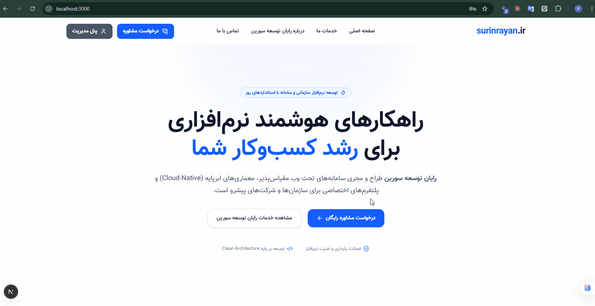

# 🚀 SurinRayan — Admin Dashboard & Contact Management System
<p align="center">
A modern full-stack web application designed for managing incoming customer support requests and administrative management, built with a <strong>.NET 10 Web API backend and a <strong>Next.js 15 (App Router)</strong> frontend.
</p>  
<p align="center">
  
</p>
<p align="center">
  <a href="https://github.com/PouyaBasiri/SurinRayan/actions">
    
  </a>
  
  
  
  
  <a href="./LICENSE">
    
  </a>
</p>

## 🛠 Tech Stack

### Backend (.NET 10)
- **Framework:** ASP.NET Core Web API (.NET 10)
- **Authentication & Security:** JWT Bearer Token, Claim-based authorization
- **Architecture:** Clean Layered Architecture / DTO Patterns
- **Services:** Protocol Buffers / gRPC support, MailKit/MimeKit integration

### Frontend (Next.js 15)
- **Framework:** Next.js 15 (App Router) & React 19
- **Styling:** Tailwind CSS, Lucide Icons
- **State & Auth:** JWT Decode, Secure Cookie/Storage Management, Middleware Route Guarding

---

## ✨ Key Features

- 🔐 **JWT Authentication System:** Secure admin login flow with token generation, decoding, and cookie/local storage persistence.
- 🛡️ **Protected Route Guards:** Client-side and server-side route protection using Next.js `middleware.ts` for all `/admin/*` routes.
- 💬 **Contact Request Management:** View, filter, and review incoming user messages in an intuitive admin panel.
- 📬 **Database Persistence & Email Handler:** Flexible reply system designed to persist admin responses in the database with optional email transmission handlers.
- 🎨 **Responsive Admin UI:** Custom sidebar navigation with active path highlighting, dynamic user profile presentation, and hydration-safe rendering.

---

## 📁 Repository Structure

```text
SurinRayan/
├── .github/          
├── frontend/
│   └── web/          Next.js (شامل src, package.json و...)
├── src/              .NET (Controllers, Services, DTOs)
├── tests/            Unit Tests / Integration Tests
├── .gitignore
├── LICENSE
├── SECURITY.md
├── docker-compose.yml
├── NuGet.Config
├── README.md
└── SurinRayan.sln    # .NET 10 Web API Solution
```

## 🚀 Getting Started

### 1.‌ .NET 10
```bash
cd backend
dotnet restore
dotnet run

URL:http://localhost:5054
```

### 2. Next.js
```bash
cd frontend
npm install
npm run dev

URL:http://localhost:3000
```

## 🔑 Demo Access Credentials
Run CLI:
docker compose up --build 

To test the admin panel out of the box:

Login Route: /login

Email: admin@surinrayan.ir

Password: admin123
